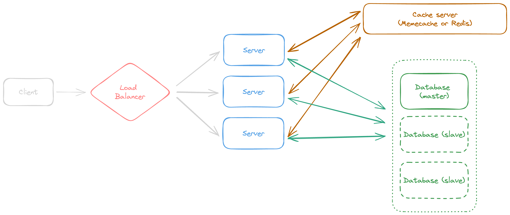

# URLBook
__URLBook__ is a sample project of URL-shortener platform with focus on backend side. 

## System design
### Functional requirement
- There should be an API (without OAuth action) that user can submit a valid URL for shortening.
- Shorted URL can have a system generated phrase or user customized value.
- The limitation for system generated phrase is up to 7 character
- The limitation for user customized phrase is up to 16 character
- The Shorted URL will not expire
- Shorted URL must redirect to the destination with status of 302
- With having shorted URL, can monitor the number of clicks and the device types which used for browse the link.

### Non-Functional requirement
- System should be highly available (99.9% uptime)
- 500k url submitted to the system per day
- 200M redirection request per month ( 200M / (30Day * 24h * 3600s) = 80tps )

### High-level Design Diagram

    

## Todo
- [x] Create project system design
- [ ] Setup required services with docker-compose
  - [ ] Database (mysql)
  - [ ] Cache (memcached)
- [ ] Only submit a url and get a system generated short url
- [ ] Redirect the system generated short-url to its original url with 302 HTTP status code
- [ ] Submit a url with custom name for shortening
- [ ] Bring caching mechanism
- [ ] Add configurable cache update job
- [ ] Add some tracking mechanism on urls
  - [ ] Number of clicks with date
  - [ ] The devices used to visit the link
  - [ ] etc.

